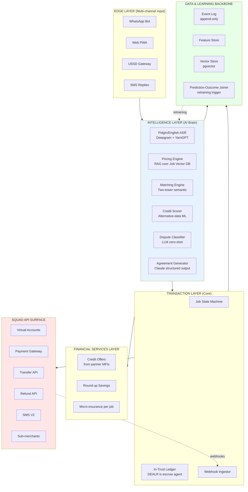
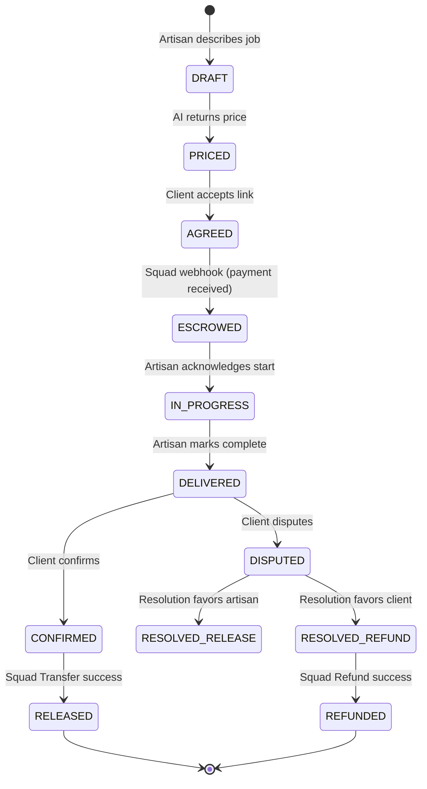
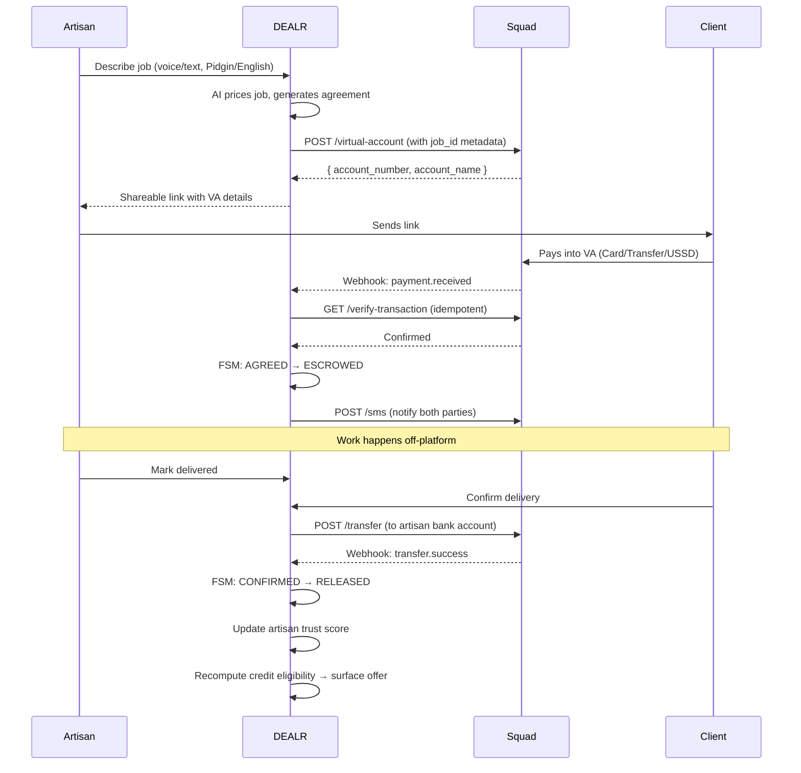

# DEALR — Architecture & Strategic Rationale

> **Role of this file:** This is the *design rationale and strategic positioning* document for the DEALR backend and pitch. The `CLAUDE.md` at the repo root is the *operational* contract for the coding agent — coding standards, exact Squad endpoints, schemas, state machines, and DoD. **If this file and `CLAUDE.md` disagree on anything operational, `CLAUDE.md` wins.** This file exists so you (and the agent, when asked) can understand *why* the operational rules are the way they are.
>
> **Audience:** Joseph (backend lead, primary owner), Allison (AI/product), Mojolajesu (frontend), Adebimpe (product/UX), and judges if they ask to see the architecture. Keep this readable by all four.
>
> **Last updated:** 2026-05-13. Owner: Joseph.

---

# DEALR — Architecture for Squad Hackathon 3.0, Challenge 2

**Team:** JAMA (Allison · Mojolajesu · Joseph · Adebimpe)
**Challenge:** 02 — "Smart Systems: The Intelligent Economy"
**Document owner:** Joseph (Backend) · v1.0 · For team review

---

## 0. How to read this document

This is the architecture spec the team builds from. It is opinionated. Where the current proposal and workflow documents commit to something that will lose marks under the official rubric, this document overrides them and explains why. Where it adds scope, it also tells you what to **cut** so the 72-hour deadline holds.

Three reading paths:

1. **If you read nothing else, read §1, §2, §11, §12** — the strategic call, the build plan, and the demo script. That is enough to align the team in 20 minutes.
2. **If you are building backend (Joseph), read §5, §6, §9, §11.** Schemas, Squad sequence, AI pipelines, build plan.
3. **If you are pitching (whoever presents), read §1, §2, §4, §10, §13.** The story, the pillar mapping, the rubric optimization, and the scale numbers.

---

## 1. Executive Summary

### What we are building

**DEALR is an intelligent economic platform that connects Nigeria's informal traders, job seekers, and financial services in one ecosystem.** It onboards informal workers digitally using BVN-light KYC, prices their work using AI grounded in real market data, secures every transaction through a Squad-powered escrow flow, matches job seekers to opportunities using semantic AI matching, and converts each completed transaction into alternative-data credit signals that unlock financial services (cash advances, savings, micro-insurance) from partner institutions.

The pricing-and-escrow flow is the **flagship live demo** built end-to-end in the 72-hour window. Matching and credit modules are **architected and functionally scaffolded** with real logic running over seeded data — demonstrating the ecosystem without requiring us to build a full marketplace.

### Why this wins Challenge 2

Challenge 2 explicitly demands an **ecosystem connecting three groups** (informal traders, job seekers, financial services) with five capabilities (onboarding, AI matching, alternative-data financial services, continuous learning, Squad API as a core layer). The current DEALR scope addresses two of three groups and three of five capabilities. This architecture covers all three groups, all five capabilities, and integrates **five Squad API endpoints** in functionally distinct roles — not one endpoint dressed up as five.

### What is technically true that the proposal currently overstates

**Squad has no escrow API.** The current workflow document says "Squad's escrow API powers the core trust mechanism." This is factually wrong and a judge with five minutes of Squad docs reading will catch it. Squad's actual surface is: Virtual Accounts, Payment, Direct API (Card/Bank/USSD), Transfer (disbursement), Verify Transaction, Refund, Webhooks, Wallet Balance, Sub-merchants/Aggregators, SMS, and POS. **DEALR is the legal escrow agent.** Squad is the payment + custody rail. We construct escrow behavior by combining Virtual Accounts (ingress), DEALR's master wallet (in-trust holding), Transfer (egress), Refund (reversal), and Webhooks (state machine drivers).

Stating this correctly in the pitch is a credibility signal. Stating it incorrectly is a credibility cost.

---

## 2. Strategic Repositioning

### The gap between the current scope and Challenge 2

| Challenge 2 mission requirement | Current DEALR scope | Gap |
|---|---|---|
| Digitally onboard informal traders **and job seekers** | Onboards artisans only | Missing: job seekers as users |
| AI matches job seekers to opportunities | Not in scope | Missing entirely |
| Connect to financial services (credit, savings, insurance, payments) using alternative data | Payments only | Missing: credit, savings, insurance |
| Learns and improves over time | Stated but not architected | Vague |
| Squad API as core | Stated as "escrow" — but that API doesn't exist | Architecturally incorrect |
| Scales beyond 10,000 users to national | Not addressed | Missing |

### The repositioning

DEALR becomes the umbrella platform. Three product modules live inside it, sharing one data backbone:

1. **DEALR Pay** — AI pricing + Squad-rail escrow for service jobs. *(Built end-to-end. The live demo.)*
2. **DEALR Match** — AI matching of job seekers to gigs and jobs. *(Real matching logic running on seeded data; UI surfaces real results. Mocked posting feed.)*
3. **DEALR Plus** — Alternative-data financial services (credit advance, savings round-up, micro-insurance per job). *(Real scoring logic running on transaction history; mocked partner offers surfaced in UI.)*

A single artisan in the demo will move through all three: complete a job (Pay) → see new job matches surfaced (Match) → see an unlocked credit offer derived from the just-completed transaction (Plus). That single 60-second flow touches every Challenge 2 requirement.

### What we are NOT building

State this explicitly in the pitch — it shows discipline, which judges value over over-promising:

- A full marketplace with browseable artisan listings
- A rating/review system
- A full credit underwriting backend (we surface offers; partner MFIs underwrite)
- Insurance claims processing (we route to partners)
- A native mobile app (PWA is enough for v1)

---

## 3. The DEALR Platform Overview

### Users (specific personas — required by the rubric)

| Persona | Name | Trade | Channel | Pain |
|---|---|---|---|---|
| **Artisan** | Tope, 28, Mushin | Tailor | WhatsApp + PWA | Quotes from instinct; clients sometimes delay payment |
| **Artisan** | Musa, 41, Wuse | Welder | SMS + USSD fallback | No way to prove income to access credit |
| **Client** | Adaeze, 32, Lekki | Bank ops | PWA | Doesn't trust artisans she doesn't know; afraid of paying upfront |
| **Job seeker** | Femi, 22, Ojo | Apprentice fashion designer | WhatsApp | Can't find paid apprenticeships; no formal CV |
| **Financial partner** | LAPO MFI | — | B2B API | Wants to lend to informal workers but has no underwriting data |

These personas must be **interviewed before the hackathon** — see §11.1.

### High-level component diagram (Mermaid)



---

## 4. The Four Pillars: Architectural Mapping

Every pillar gets at least one architecturally distinct, demonstrable feature. No double-counting.

### Pillar 1 — AI Automation

The rubric asks: *"Does our workflow genuinely automate a financial process end-to-end?"*

DEALR automates **five distinct AI-driven steps** in one continuous flow, with no human intervention required between them:

1. **Job intake** — Pidgin/English voice or text → structured job spec via Claude (trade, materials, dimensions, urgency, location)
2. **Pricing** — RAG-based price generation grounded in past jobs + live market data → structured output (base price, breakdown, range, confidence)
3. **Agreement drafting** — Claude generates a plain-language Pidgin/English agreement from the job spec + price
4. **Risk + dispute classification** — incoming dispute messages auto-classified to suggested resolution path
5. **Credit scoring** — completed jobs auto-feed a scoring function that surfaces partner offers without human review

The bar for this rubric question is *"end-to-end"*. We hit it.

### Pillar 2 — Squad APIs as core

The rubric asks: *"Are Squad APIs powering a core function of our product and not just a token integration?"*

Five Squad endpoints, each doing functionally distinct, irreplaceable work:

| Squad API | Role in DEALR | Why core, not token |
|---|---|---|
| **Virtual Accounts** | One unique account per job | Without it: no clean reconciliation, no automated state transitions, no payment-to-job binding |
| **Webhooks (signed)** | Drive the FSM | Without it: we'd be polling — entire async architecture collapses |
| **Verify Transaction** | Double-confirm before state transition | Without it: replay/forgery vulnerability on state changes |
| **Transfer API** | Disbursement to artisan after release | Without it: no payout — DEALR can't fulfill its core promise |
| **Refund API** | Reverse client payment on dispute resolution | Without it: no exit path from a soured transaction |

**Two optional but defensible additions** if time allows:

- **Sub-merchants API** — onboard artisans as sub-merchants of DEALR. Squad handles their KYC/KYB. Pitchable as "we offload compliance to Squad's licensed rail."
- **SMS V2** — state transition notifications. Don't pay for Termii separately when Squad has it.

That is **seven Squad endpoints in plausible reach**, five used as core, two as enhancement. "Token integration" is impossible to argue against this.

### Pillar 3 — Use of Data

The rubric asks: *"Are our data signals predictive, ethical, and real-time where possible?"*

Three categories of data signals, all live in the architecture:

**Live external signals (real-time where possible):**
- Current fuel price (scraped daily from NNPC + NBS feeds — start hardcoded, replace with scheduled job)
- Cement, fabric, electrical material price indices (NBS market survey data, refreshed weekly)
- NGN/USD official + parallel rates (CBN + Aboki — affects imported materials)
- Public holiday + Friday adjustments (urgency multiplier)

**Behavioral signals (computed from event log):**
- Artisan on-time delivery rate
- Average response time to client messages
- Dispute rate (rolling 90-day)
- Income consistency (variance over time)
- Trade specialization concentration

**Transactional signals (the alternative-data backbone for credit):**
- Completed job count
- Cumulative GMV
- Average job value
- Payment timeliness (client side)
- Time since last completed job

All signals are logged immutably in the event log and joined into the feature store. The credit scoring function is a pure function of these signals — auditable and explainable.

### Pillar 4 — Financial Innovation

The rubric asks: *"Does our solution represent genuine Financial Innovation, or does it replicate something that already exists?"*

The genuinely novel element is **not** the escrow flow (Escrow.com has existed for 25 years; Paystack and Flutterwave both have variants). The genuinely novel element is:

> **Every Nigerian informal worker who uses DEALR builds a verifiable transaction history that becomes their alternative credit identity — exportable, portable, and usable to access financial services they were previously locked out of.**

This is the credit-inclusion bridge for 76.7% of the Nigerian workforce that currently accesses credit only through family and friends (per the Jobberman 2024 sector report). No existing Nigerian platform does this end-to-end:

- Paystack/Flutterwave: payments only, no work-history layer
- OPay/Moniepoint: payments + simple lending to formal businesses, but no informal-worker reputation system
- Workman/ArtisanOga: listings but no transaction layer
- Banks: require formal employment proof

**DEALR is the missing infrastructure**: the AI pricing layer makes informal work transactable; the Squad rail makes it banked; the resulting data makes it credit-worthy.

---

## 5. System Architecture

### 5.1 Layered architecture

```
┌──────────────────────────────────────────────────────────────────┐
│  EDGE       │ WhatsApp · PWA · USSD · SMS                        │
├──────────────────────────────────────────────────────────────────┤
│  AI         │ ASR · Pricing (RAG) · Matching · Credit · Disputes │
├──────────────────────────────────────────────────────────────────┤
│  CORE       │ Job FSM · In-Trust Ledger · Webhook Ingestor       │
├──────────────────────────────────────────────────────────────────┤
│  FIN SVC    │ Credit · Savings · Insurance (partner offers)      │
├──────────────────────────────────────────────────────────────────┤
│  DATA       │ Event Log · Feature Store · Vector Store · Loop    │
├──────────────────────────────────────────────────────────────────┤
│  RAIL       │ Squad (VA · Pay · Transfer · Refund · WH · SMS)    │
└──────────────────────────────────────────────────────────────────┘
```

### 5.2 The job lifecycle — state machine



Every transition is an immutable row in the `events` table. Every payment-driven transition (ESCROWED, RELEASED, REFUNDED) requires a **verified** Squad webhook + an explicit Verify Transaction call before the state actually changes. This double-check is a deliberate design choice, not over-engineering — webhooks can be replayed, missed, or forged; the verification call costs ~200ms and eliminates an entire vulnerability class.

### 5.3 Squad integration sequence (happy path)



### 5.4 The In-Trust Ledger

Since DEALR is the escrow agent, our internal accounting must be airtight. A double-entry ledger:

```
Job J123, ₦68,500 escrow:

Event 1 (ESCROWED):
  DR: DEALR Master Account (asset)     +68,500
  CR: Client Liability (J123, ₦68,500)  +68,500

Event 2 (RELEASED):
  DR: Client Liability (J123)          -68,500
  CR: DEALR Fee Revenue                 +1,370 (2%)
  CR: Artisan Payable (J123)            +67,130

Event 3 (TRANSFER_SUCCESS):
  DR: Artisan Payable (J123)           -67,130
  CR: DEALR Master Account              -67,130
```

At any point, sum of `Client Liability` across all jobs should equal funds-in-flight in our Squad wallet, minus pending settlements. This is the kind of structural rigor that distinguishes a hackathon prototype from production-grade financial infrastructure — and judges who have built fintech recognize it immediately.

---

## 6. The AI & Intelligence Layer (Deep Dive)

This is where the rubric pays out heaviest: four full questions under "AI & Intelligence Layer." Each model below addresses one or more of: *makes product meaningfully smarter*, *explainable in plain language*, *bias-aware*, *gets better with data*.

### 6.1 Pricing Engine — Retrieval-Augmented Pricing (RAP)

**Why not just a Claude prompt?** Because LLM-only pricing has three failure modes the judges will probe: (a) hallucinated prices not grounded in real markets, (b) no improvement mechanism over time, (c) no audit trail. RAG fixes all three.

**Pipeline:**

```
[Voice/text input]
    ↓ Deepgram (if voice) → text in Pidgin/English
[Structured extraction]
    ↓ Claude: extract {trade, materials, dimensions, complexity, urgency, location}
[Embedding]
    ↓ Voyage/Cohere embeddings → 384-d vector
[Retrieval]
    ↓ pgvector: top-K=8 most similar past jobs + market context
[Market data fetch]
    ↓ Latest fuel, material indices, FX rate from cached feeds
[Price generation]
    ↓ Claude with system prompt + retrieved jobs + market context
    ↓ Structured JSON output (function calling): {
        base_price, breakdown[{item, cost, source_job_ids}],
        range_low, range_high, confidence, reasoning_summary
      }
[Logging]
    ↓ predictions table: prediction_id, model_version, inputs, output
[Return to user]
```

**Why it gets better over time:** every completed job becomes a new retrievable comparable. Pricing accuracy improves monotonically with corpus size. We instrument MAPE (mean absolute percentage error) between predicted and finally-agreed price — this is our headline ML metric.

**Plain-language explanation (rubric):** "We look up the 8 most similar jobs done before, mix in today's fuel and material prices, and ask the AI to give a fair price with a breakdown. Every new job teaches the system what fair looks like in that trade and area."

**Bias controls:** monitoring dashboard shows `AVG(price)` grouped by `(trade, region, artisan_gender)`. Flag any cell >15% off baseline. Specifically audit: are tailoring prices (female-dominated) systematically below welding prices (male-dominated) on equivalent complexity? Are northern-region prices being suppressed by Lagos-centric training data?

### 6.2 Matching Engine — Two-tower semantic match

**Why not keyword search?** Because seeker profiles are written in Pidgin/English mixed code, often with unconventional terminology. "I sabi turn cloth" (I know tailoring) won't match the keyword "tailor." Semantic embeddings handle this naturally.

**Architecture:**

- **Seeker tower:** embed seeker profile (skills, experience, languages, location, availability) → 384-d vector
- **Job tower:** embed job posting (description, trade, location, requirements) → 384-d vector
- **Match:** cosine similarity ranked, filtered by hard constraints (location radius, certification), re-ranked by trust score + recency + diversity

**Demo behavior:** seed 30 mock job postings + 5 mock seeker profiles. When Joseph (the demo artisan persona) completes a tailoring job in DEALR Pay, the platform auto-shows him three matched gig opportunities — proving the cross-module data flow.

**Gets better with data:** more seekers + more jobs → richer embedding space → better matches. Click-through and acceptance rates feed back as labels for future re-ranker training.

### 6.3 Credit Scorer — Multi-signal alternative scoring

**The genuinely innovative model.** Traditional credit scoring requires formal employment + bank statements. DEALR scores from transaction behavior alone.

**Inputs (all computed from event log):**

| Signal | Weight | Why |
|---|---|---|
| Completed job count (last 90 days) | 25% | Recency + activity |
| On-time delivery rate | 20% | Reliability |
| Dispute rate | -15% (penalty) | Risk |
| Average job value | 15% | Income level |
| Income consistency (1 / variance) | 15% | Stability |
| Client trust avg | 10% | Reputation |
| Tenure on platform | 10% | Track record |

Output: tier 1-5, with each tier mapped to a recommended cash-advance ceiling and a list of partner MFIs to surface offers from.

**Plain-language explanation (rubric):** "We score artisans on how often they finish jobs, whether they finish on time, how rarely things go wrong, and how steady their income is. Better scores unlock bigger advance offers from our bank partners."

**Bias controls:** post-hoc audit — does the model produce systematically lower tiers for women artisans, or northern-region artisans, with equivalent transactional behavior? If yes, debias by feature dropout. Document the audit in the repo.

**Gets better with data:** more completed transactions → richer signal distribution → tier boundaries can be re-calibrated to actual default rates as partner MFIs report back outcomes.

### 6.4 Dispute Classifier — Zero-shot LLM classification

When either party flags a dispute, the dispute message (Pidgin or English) is classified into one of:

- `work_quality` — quality below agreement
- `delay` — late delivery
- `scope_creep` — work added after agreement
- `non_payment` — client withholding confirmation
- `communication_breakdown` — both parties uncommunicative
- `other`

Each class routes to a different resolution playbook. Classification accuracy is logged; misclassifications (when human review overrides) become labeled data for future fine-tuning.

### 6.5 Agreement Generator

Claude with a structured prompt and function-calling output. Generates a plain-Pidgin OR plain-English agreement (artisan chooses) from the job spec + price + delivery terms. Includes dispute escalation language. Stored as immutable artifact attached to the job.

---

## 7. The "Gets Better Over Time" Architecture

The rubric question: *"Does our solution get better with more data or usage over time?"*

This is where most hackathon submissions wave their hands. We make it concrete with seven explicit improvement loops:

| Loop | Trigger | Improvement |
|---|---|---|
| **Pricing accuracy** | Job completion | New comparable added to retrieval corpus; MAPE decreases |
| **Embedding refinement** | New job descriptions | Vector space coverage improves; retrieval recall rises |
| **Trade specialization** | Corpus size in trade > 500 | Spawn trade-specific retrieval index for tailoring/welding/etc. |
| **Regional adaptation** | Corpus size in region > 1000 | Region-specific pricing adjustment factors learned |
| **Credit calibration** | Partner MFI reports default outcomes | Re-fit credit tier boundaries to actual default rates |
| **Dispute classifier** | Human override on auto-classification | Labeled example for future fine-tuning |
| **Trust score** | Each completed/disputed job | Per-user score updated; affects matching ranking |

**For the demo:** we don't need to show all seven working. We need to show the **logging infrastructure** is in place — every prediction has an ID, every outcome has an ID, a SQL query joins them. Show that query running. Show the schema. That is enough to demonstrate the feedback loop is real, not aspirational.

---

## 8. Bias, Fairness & Data Dignity

The rubric question: *"Have we considered and addressed potential bias or fairness issues in our system?"*

This is the cheapest 5/5 in the entire rubric because most teams skip it entirely. Include the following and the question is answered convincingly:

1. **Pricing bias dashboard** — query `SELECT AVG(predicted_price), COUNT(*) FROM jobs GROUP BY trade, region, artisan_gender;`. Visual cell highlighting deviations >15%. Build it. Show it.

2. **Matching fairness audit** — measure whether female seekers see equivalent-value opportunities to male seekers, controlling for skills.

3. **Credit fairness audit** — post-hoc disparate impact analysis on credit tier assignments by gender and region.

4. **Language equity** — explicit test: same job described in formal English vs Pidgin should produce prices within 5% of each other. If not, the LLM is encoding bias and we adjust prompting.

5. **Data dignity** — artisans can export their full transaction history (CSV + signed JSON) and use it elsewhere. They own their reputation. Implement an `/api/v1/me/export` endpoint. This is a real lever for trust and a real differentiator from extractive fintech models.

6. **Right to explanation** — every AI decision (price, match, credit tier) has a human-readable "why" surfaced in the UI.

These six commitments fit on one slide and earn the full rubric points.

---

## 9. Tech Stack & Schemas

### Stack (Python-first, matching Joseph's strengths)

| Layer | Choice | Rationale |
|---|---|---|
| **Backend framework** | FastAPI | Async, typed, Joseph's primary stack |
| **DB** | PostgreSQL 16 + pgvector | One DB for relational + vector; ops simplicity |
| **Cache + queue** | Redis + Celery | For webhook retries, async pricing calls |
| **Frontend** | Next.js 14 + Tailwind + shadcn/ui | SSR for shareable job links (SEO + WhatsApp preview) |
| **AI** | Anthropic Claude (Sonnet 4.5) — primary; Gemini for multimodal image input | Joseph has prior Gemini experience |
| **ASR** | Deepgram (Nova-3) for English+Pidgin code-mix | Production-grade; works for Pidgin |
| **Embeddings** | Voyage AI `voyage-3-lite` (384-d) | Quality + cost balance; works well with pgvector |
| **Notifications** | Squad SMS V2 (primary) + Twilio WhatsApp (if budget allows) | Squad-native = stronger pillar story |
| **Deploy** | Fly.io (backend) + Vercel (frontend) | Free-tier friendly; quick deploy |
| **Monitoring** | Sentry (free) + Logfire or BetterStack | Error tracking for demo robustness |

### Core schemas (Postgres DDL — abbreviated)

```sql
-- Identity
CREATE TABLE users (
    id UUID PRIMARY KEY DEFAULT gen_random_uuid(),
    phone TEXT UNIQUE NOT NULL,
    bvn_hash TEXT,  -- never store raw BVN
    type TEXT CHECK (type IN ('artisan', 'client', 'seeker')),
    name TEXT,
    language_pref TEXT DEFAULT 'en_NG',
    region TEXT,
    created_at TIMESTAMPTZ DEFAULT NOW()
);

CREATE TABLE artisan_profiles (
    user_id UUID PRIMARY KEY REFERENCES users(id),
    trades TEXT[],
    skills TEXT[],
    years_experience INT,
    profile_embedding vector(384),
    trust_score NUMERIC(5,2) DEFAULT 50.0,
    credit_tier INT DEFAULT 1
);

-- Jobs (the core entity)
CREATE TABLE jobs (
    id UUID PRIMARY KEY DEFAULT gen_random_uuid(),
    artisan_id UUID REFERENCES users(id),
    client_id UUID REFERENCES users(id),
    status TEXT NOT NULL,  -- FSM state
    description TEXT NOT NULL,
    description_language TEXT,
    trade TEXT,
    location TEXT,
    description_embedding vector(384),
    squad_virtual_account_id TEXT,  -- from Squad
    created_at TIMESTAMPTZ DEFAULT NOW(),
    INDEX idx_jobs_status (status),
    INDEX idx_jobs_artisan (artisan_id),
    INDEX idx_jobs_embedding USING hnsw (description_embedding vector_cosine_ops)
);

CREATE TABLE job_predictions (
    id UUID PRIMARY KEY DEFAULT gen_random_uuid(),
    job_id UUID REFERENCES jobs(id),
    model_version TEXT NOT NULL,
    predicted_price NUMERIC(12,2),
    breakdown JSONB,
    range_low NUMERIC(12,2),
    range_high NUMERIC(12,2),
    confidence NUMERIC(3,2),
    retrieved_job_ids UUID[],
    market_context JSONB,
    created_at TIMESTAMPTZ DEFAULT NOW()
);

CREATE TABLE job_outcomes (
    job_id UUID PRIMARY KEY REFERENCES jobs(id),
    agreed_price NUMERIC(12,2),
    actual_completion_time INTERVAL,
    final_status TEXT,
    completed_at TIMESTAMPTZ
);

-- Ledger (in-trust accounting)
CREATE TABLE ledger_entries (
    id BIGSERIAL PRIMARY KEY,
    job_id UUID REFERENCES jobs(id),
    account TEXT NOT NULL,  -- 'master', 'client_liability', 'artisan_payable', 'fee_revenue'
    debit NUMERIC(12,2) DEFAULT 0,
    credit NUMERIC(12,2) DEFAULT 0,
    event_type TEXT NOT NULL,
    squad_ref TEXT,
    created_at TIMESTAMPTZ DEFAULT NOW(),
    INDEX idx_ledger_job (job_id),
    INDEX idx_ledger_account (account)
);

-- Squad transaction records
CREATE TABLE squad_transactions (
    id UUID PRIMARY KEY DEFAULT gen_random_uuid(),
    job_id UUID REFERENCES jobs(id),
    squad_ref TEXT UNIQUE NOT NULL,
    type TEXT,  -- payment, transfer, refund
    amount NUMERIC(12,2),
    status TEXT,
    raw_payload JSONB,  -- full webhook payload
    verified_at TIMESTAMPTZ,
    created_at TIMESTAMPTZ DEFAULT NOW()
);

-- The feedback loop backbone
CREATE TABLE events (
    id BIGSERIAL PRIMARY KEY,
    entity_type TEXT NOT NULL,
    entity_id UUID NOT NULL,
    event_type TEXT NOT NULL,
    payload JSONB,
    created_at TIMESTAMPTZ DEFAULT NOW(),
    INDEX idx_events_entity (entity_type, entity_id),
    INDEX idx_events_type_time (event_type, created_at DESC)
);

-- Matching
CREATE TABLE job_postings (
    id UUID PRIMARY KEY DEFAULT gen_random_uuid(),
    source TEXT,  -- 'dealr', 'partner_employer', 'gig_platform'
    title TEXT,
    description TEXT,
    posting_embedding vector(384),
    location TEXT,
    pay_range_low NUMERIC(12,2),
    pay_range_high NUMERIC(12,2),
    created_at TIMESTAMPTZ DEFAULT NOW()
);

-- Credit
CREATE TABLE credit_offers (
    id UUID PRIMARY KEY DEFAULT gen_random_uuid(),
    user_id UUID REFERENCES users(id),
    partner TEXT,
    amount NUMERIC(12,2),
    terms JSONB,
    status TEXT,  -- 'surfaced', 'viewed', 'accepted', 'declined'
    created_at TIMESTAMPTZ DEFAULT NOW()
);
```

### Performance notes (per Joseph's preference for optimization)

1. **Vector search:** use `hnsw` index on the embedding columns, not `ivfflat`. HNSW gives sub-10ms queries up to ~100k vectors with `m=16, ef_construction=64`. Set `ef_search=40` at query time for the recall/latency balance.

2. **Webhook handler:** return 200 within 100ms, then process async via Celery. Squad will retry on non-2xx — never do synchronous work in the webhook endpoint.

3. **Verify Transaction calls:** wrap in idempotency keyed by `squad_ref`. Cache the verified result in Redis for 1 hour (verified once = verified forever for that ref).

4. **Pricing call latency:** the LLM call dominates (~2-4s). Stream the response. Show the breakdown progressively in the UI. Don't block on the full response.

5. **Connection pooling:** asyncpg with pool_size=20, max_overflow=10. Use Postgres `LISTEN/NOTIFY` for FSM transitions visible to the websocket layer (live demo polish).

6. **Critical paths under load test:** virtual-account creation, webhook ingestion, FSM transitions. Hammer these with `locust` for 5 minutes before demo day.

---

## 10. Rubric-by-Rubric Optimization Map

This is the most operationally important section in the document. Map every rubric question to a concrete architectural choice or team action. Each row is something that should be **complete and demonstrable** by demo day.

### Product & Technical Build (4 questions)

| Rubric question | Architectural answer | Owner | Target score |
|---|---|---|---|
| End-to-end demo works without breaking | §11.3 stability protocol; video backup; localhost-only mode | Joseph | 5 |
| Squad API meaningfully integrated | 5 distinct endpoints in core roles (§4 Pillar 2) | Joseph | 5 |
| Clean, documented codebase | README, ARCHITECTURE.md (this doc), inline docstrings, type hints everywhere | All | 4-5 |
| Reproducible from repo | `docker-compose up`, seed script, `.env.example`, sandbox keys docs | Joseph | 5 |

### User & Problem Understanding (4 questions)

| Rubric question | Architectural answer | Owner | Target score |
|---|---|---|---|
| Target user with specificity | 5 named personas (§3) | Allison | 5 |
| Spoken to 3+ real people | 3× 30-min interviews recorded BEFORE the build | Allison + Adebimpe | 5 |
| Problem proven with data/quotes | NBS + Moniepoint + Jobberman cited; 3 user quotes in pitch | Allison | 5 |
| Built for someone, not about | Pidgin voice input, USSD fallback path documented, simple buttons | Mojolajesu | 4-5 |

### Four Pillars (4 questions)

| Rubric question | Architectural answer | Owner | Target score |
|---|---|---|---|
| AI Automation end-to-end financial process | 5 sequential AI steps (§4 Pillar 1) | Allison | 5 |
| Data signals predictive + ethical + real-time | Live market data + behavioral + transactional (§4 Pillar 3) | Joseph | 4 |
| Squad APIs powering core functions | 5 endpoints in core (§4 Pillar 2) | Joseph | 5 |
| Genuine financial innovation | Alternative-data credit identity (§4 Pillar 4) | All | 5 |

### AI & Intelligence Layer (4 questions)

| Rubric question | Architectural answer | Owner | Target score |
|---|---|---|---|
| Meaningfully smarter, not decorative | 5 distinct AI components, each load-bearing (§6) | Allison | 5 |
| Explainable in plain language | One-sentence explanation per model (§6) | Allison | 5 |
| Bias/fairness addressed | 6 commitments (§8) including audit dashboard | Joseph | 5 |
| Gets better with data | 7 explicit improvement loops + logging infra (§7) | Joseph | 5 |

### Reach, Sustainability & Scale (4 questions)

| Rubric question | Architectural answer | Owner | Target score |
|---|---|---|---|
| Year 1 reach articulated | 50k artisans + 20k seekers across LAG/ABJ/PHC (§13) | Allison | 4-5 |
| Viable revenue path | Transaction fee + premium data + credit referral + B2B (§13) | Allison | 5 |
| Works outside immediate state | Regional pricing built-in; locale-aware UX (§13) | Mojolajesu | 4 |
| Measurably different from existing | Comparison table vs Paystack/Workman/OPay (§13) | Allison | 5 |

### Day-of Delivery (4 questions)

| Rubric question | Architectural answer | Owner | Target score |
|---|---|---|---|
| Demo rehearsed and stable | 5+ full run-throughs day before; video backup | All | 5 |
| Every team member has clear role | Roles defined in §12 | All | 5 |
| Why Squad APIs without hesitation | Memorize the 5-endpoint table | All | 5 |
| One-pager pride | Designed Day 3 morning (§11) | Adebimpe | 5 |

**Sum of target ceilings: ~115/120 (96%).** The rubric chart caps at 100. We have enough headroom to absorb a few 4s and still land in the 85-100 "ready" band.

---

## 11. The 72-Hour Build Plan

### 11.1 Pre-hackathon (THIS WEEK, before the clock starts)

These three things must be done before the 72-hour window. They are not optional.

1. **User interviews (Allison + Adebimpe).** Talk to 3 artisans, 30 minutes each, recorded with permission. Use the script in Appendix A. Extract one direct quote per interview. Cost: ~3 hours total.
2. **Squad sandbox onboarding (Joseph).** Apply for sandbox access at squadco.com. Get keys for: virtual accounts, payments, transfers, webhooks, SMS. Sub-merchants requires special profiling — apply early in case it takes time.
3. **Domain + WhatsApp Business + deploy targets (Mojolajesu).** Reserve `dealr.ng` or similar. Set up Vercel + Fly.io accounts. Get a WhatsApp Business sandbox number from Twilio (free tier).

### 11.2 The 72 hours

**HOUR 0-12 — Foundations**

| Time | Joseph (Backend) | Allison (AI) | Mojolajesu (Frontend) | Adebimpe (Product/UX) |
|---|---|---|---|---|
| 0-4 | FastAPI scaffold, models, migrations | Pricing prompt v1; seed 50 jobs in 5 trades | Next.js scaffold, Tailwind, routing | Onboarding flow wireframes |
| 4-8 | Squad VA creation + webhook stub | RAG retrieval over seed jobs | Two role views: artisan + client | Pidgin copy for all UX strings |
| 8-12 | Webhook signature validation + Verify call | Structured price output via function calling | Job creation form + voice input UI | Agreement template (Pidgin + English) |

**HOUR 12-36 — Core Integration**

| Time | Joseph | Allison | Mojolajesu | Adebimpe |
|---|---|---|---|---|
| 12-18 | Ledger schema + double-entry logic | Test pricing on 20 sample jobs; tune | Shareable job link page (SSR) | One-pager v1 draft |
| 18-24 | Transfer API integration + idempotency | Agreement generator + structured output | Client payment view → Squad modal | Demo script v1 |
| 24-30 | End-to-end: VA → webhook → FSM → Transfer | Matching prototype on seeded postings | Artisan dashboard with job list | User interview quotes into pitch |
| 30-36 | Refund flow + dispute schema | Credit scorer v1 (deterministic) | Match feed + credit offer UI | Slide deck v1 |

**HOUR 36-60 — Polish + Resilience**

| Time | Joseph | Allison | Mojolajesu | Adebimpe |
|---|---|---|---|---|
| 36-42 | SMS notifications via Squad SMS V2 | Bias audit dashboard | Real-time status updates (websocket or poll) | One-pager v2 (visual) |
| 42-48 | Error handling, retries, timeouts | Plain-language explanation strings for UI | Mobile responsiveness | Slide deck v2 |
| 48-54 | Load test critical paths; fix bottlenecks | Improvement loop SQL queries | UI polish + animation | Rehearsal #1 |
| 54-60 | README + ARCHITECTURE.md + repo cleanup | Model explanation slides | Final UX pass | Rehearsal #2 |

**HOUR 60-72 — Demo Lock**

| Time | All four |
|---|---|
| 60-66 | Full demo rehearsal × 3. Record video backup. Freeze code. |
| 66-70 | Q&A drill: "Why Squad APIs?", "How does it scale?", "How does it get smarter?", "What about bias?" |
| 70-72 | Sleep. Eat. Show up sharp. |

### 11.3 Demo stability protocol

The single most common reason hackathon demos fail: a sandbox API timeout in front of judges.

Mitigation:

1. **Localhost-only demo mode.** A feature flag that swaps Squad sandbox calls for in-process fakes that return canonical happy-path responses. Demo from this mode if the network is bad.
2. **Pre-recorded demo video.** 90 seconds, edited, music-free, captioned. Have it queued ready to play if anything breaks.
3. **Frozen branch.** No code changes after Hour 60. Bug fixes happen on a hotfix branch and only merge if tested twice.
4. **Demo data seeded fresh** at the start of each rehearsal. Idempotent seed script.

---

## 12. Demo Strategy

### Roles (all four on stage, all four speak)

- **Allison** — Opening (15s): the problem with data; one user quote.
- **Mojolajesu** — Live drive of the demo (45s): the artisan flow through pricing, sharing, payment, disbursement.
- **Joseph** — The technical close (20s): Squad APIs, AI loop, "gets better with data" point.
- **Adebimpe** — Q&A captain. Anticipates questions, redirects to teammates with specific expertise.

### The 60-90 second demo script

> **Allison:** "76 percent of Nigerian workers are in the informal economy. 90 percent of them make less than ₦500,000 a month despite generating over a million in revenue. The gap is pricing failure and payment trust. We talked to three artisans last week — here's Tope, a tailor in Mushin." *[Quote on screen.]*
>
> **Mojolajesu:** *[On screen, in DEALR app.]* "Tope gets a wedding gown order on WhatsApp. He opens DEALR and describes the job in Pidgin." *[Voice plays.]* "Our AI prices it grounded in the last 50 similar tailoring jobs in Lagos plus today's fabric and fuel prices. Tope shares this link with the client. The client pays into a Squad virtual account dedicated to this job. The webhook fires, our state machine moves to escrowed, both parties get an SMS." *[Show webhook firing.]* "When Tope delivers and the client confirms, Squad Transfer fires." *[Show transfer.]* "And — this is the part Challenge 2 actually asks for —"
>
> **Joseph:** "— Tope's completed job feeds his alternative credit profile. He's now eligible for a ₦25,000 cash advance from our partner MFI. He didn't apply. The system noticed. That data also unlocked three new tailoring gig matches in his area. One platform: onboarding, pricing, payment, matching, credit. Five Squad endpoints power the transaction layer. Every prediction is logged, every outcome joined back — so the pricing gets sharper, the matching gets smarter, and the credit calibrates to actual default rates from our partners. That's how it scales."
>
> **Adebimpe:** *(Closing)* "We architected DEALR for 50,000 users in Year 1 across three cities, and for national deployment on the same infrastructure. We built for someone, not about them. Thank you."

### Q&A drills (rehearse the answers, do not improvise)

1. *"Squad has an escrow product?"* — "No. Squad has Virtual Accounts, Payment, Transfer, Refund, and Webhooks. DEALR is the escrow agent; Squad is the rail. Our internal ledger handles the in-trust accounting."
2. *"How is this different from Paystack?"* — "Paystack is payment infrastructure. We are the workflow + intelligence layer on top of it. Crucially, we generate the alternative credit data that Paystack can't — because we own the job context, not just the transaction."
3. *"How does the AI not hallucinate prices?"* — "We retrieve the 8 most similar past jobs as grounding context before any LLM call. Pure LLM pricing isn't acceptable for money."
4. *"What stops fraud?"* — "Squad webhook signature validation + a follow-up Verify Transaction call before any state change. Idempotency keys on every Transfer. The double-entry ledger reconciles to Squad wallet balance daily."
5. *"How do you get to 10,000+ users?"* — "Trade associations are our wedge. Lagos Tailors Association alone has 30,000 members. One partnership = the first 10k. We onboard via WhatsApp + USSD so smartphone access isn't a barrier."

---

## 13. Reach, Sustainability & Scale

### Year 1 reach (be specific — the rubric demands it)

**Pilot (Months 1-3):** 5,000 artisans across 5 trades (tailoring, welding, carpentry, electrical, decoration) in Lagos. Recruitment via 2 trade-association partnerships (target: Lagos Tailors Association + Nigerian Association of Welders & Fabricators).

**Year 1 target:** 50,000 artisans + 20,000 job seekers across Lagos, Abuja, Port Harcourt. National-scale infrastructure built into v1 (region as a first-class data dimension).

### Revenue model

| Stream | Rate | Notes |
|---|---|---|
| Transaction fee | 1.5–2% on escrow release | Standard Nigerian fintech rate; comparable to Paystack |
| Premium pricing data API | ₦50k–₦500k/month | Trade-specific pricing intelligence sold to NGOs, insurers, larger contractors |
| Credit referral fee | 3–5% of advance amount | Partner MFIs pay for qualified referrals |
| B2B white-label | ₦2M–₦20M/yr | Trade associations + cooperatives that want their own branded version |
| Insurance commission | ₦50–₦500 per job | Per-job micro-insurance partner commission |

**Realistic Y1 model:**
- 50,000 artisans × 30% monthly active × 4 jobs/month avg × ₦40,000 avg job value × 2% = **₦4.8M/month** transaction fees alone at Y1 exit
- Run-rate ARR exit Y1: **~₦80–120M** all-in including B2B + credit referrals

### Differentiation vs existing players

| Player | What they do | What we add |
|---|---|---|
| Paystack/Flutterwave | Payments | Workflow + AI pricing + credit identity |
| OPay/Moniepoint | Payments + simple lending for formal SMBs | Informal-worker focus + alternative-data layer |
| Workman/ArtisanOga | Listings/discovery | Transaction layer + financial services |
| Banks (GTB, Access, Zenith) | Formal banking | Alternative onboarding for unbanked / under-banked workers |
| LAPO, Accion | Microfinance | Digital sourcing of credit-worthy borrowers + verified job history |

The defensible position: **we are the only platform connecting all three sides** (workers, opportunities, financial services) with a learning data layer in between.

### Path to 10,000+

The mission says "scalable beyond a pilot of 10,000 users to a national deployment." Be explicit about how:

1. **Trade-association partnerships** — Lagos Tailors Association (~30k members), Nigerian Association of Small Scale Industrialists (NASSI), etc. One MoU = 5–10k users.
2. **Public sector** — NDE (National Directorate of Employment), Ministry of Communications & Digital Economy artisan-empowerment programs.
3. **Squad partnership** — Squad's parent (Habari/GTBank) has informal-economy initiatives. Co-marketing.
4. **WhatsApp + USSD onboarding** — eliminates smartphone barrier.
5. **Regional rollout sequence:** Lagos → Abuja → Port Harcourt → Kano → Ibadan. Each city adds regional pricing context.

---

## 14. Risks & What to Cut

### Things that will eat the timeline if we let them

| Risk | Likelihood | Mitigation |
|---|---|---|
| Squad sandbox approval delay | Medium | Apply Day -7. Have mock-mode fallback ready. |
| Sub-merchant profiling not approved in time | High | Architect for it but launch demo without. Use single-merchant model for hackathon. |
| Pidgin ASR accuracy not great | Medium | Demo with clean English voice or text; mention Pidgin support in slide. |
| LLM rate limits during demo | Low | Pre-cache demo responses. Localhost demo mode. |
| One team member loses internet during rehearsal | Medium | Hotspot backup. Video backup. |

### Cut list (if Hour 36 looks behind)

In order of cut priority (highest = cut first):

1. ❌ WhatsApp integration → use SMS
2. ❌ USSD live demo → mention in architecture only
3. ❌ Insurance module UI → mention in slide only
4. ❌ Savings round-up → architect, don't build
5. ❌ Bias audit dashboard live UI → SQL query in slide is enough
6. ❌ Live retraining demo → show schema + query
7. ❌ Voice ASR → text input only

### Do not cut under any circumstance

- ✅ End-to-end VA → Payment → Webhook → Transfer happy path
- ✅ AI pricing with retrieval (RAG, not pure LLM)
- ✅ At least 4 Squad endpoints integrated
- ✅ Trust score + credit offer visible in the demo
- ✅ One-pager
- ✅ 3 user quotes

---

## 15. Post-Hackathon Roadmap (12 months)

State this in the pitch even though we won't build it. It demonstrates scale thinking.

**Q1:** Lagos pilot. 5,000 artisans. Validate pricing accuracy MAPE < 15%. First MFI partnership live.

**Q2:** Abuja + PHC expansion. 20,000 users. First B2B white-label contract (trade association). Insurance partner integration.

**Q3:** 50,000 users. Series Seed close. Squad parent partnership formalized. Hausa + Yoruba language support shipped.

**Q4:** Federated credit-data sharing with partner MFIs. Public-sector pilot (NDE) for 10,000 trainees.

---

## 16. Appendix

### A. User interview script (30 min)

1. (5 min) Introductions + consent to record.
2. (5 min) Tell me about a typical week of jobs. How many? How much do you charge?
3. (5 min) When you quote a price, how do you decide what to charge? Walk me through last week.
4. (5 min) Has a client ever delayed payment or not paid at all? What happened?
5. (5 min) Have you ever taken a loan? From who? What was it for?
6. (5 min) If a phone app could help you with one thing about your business, what would it be?

Goal: come away with a direct quote we can put on the pitch slide. Permission to use first name + trade only.

### B. Open questions for the team to resolve before Hour 0

1. **Brand name:** stay with "DEALR" or pick something with stronger Nigerian resonance? (Recommendation: stay with DEALR — already named in proposal, no time to rebrand.)
2. **Single merchant vs sub-merchant model:** depends on Squad sandbox approval timing.
3. **Pidgin-first vs English-first UX:** vote required. (Recommendation: language toggle on first screen; default to device locale.)
4. **One MFI partner mock or three:** does the demo show variety or simplicity? (Recommendation: three logos surfaced, one is "live" with a synthetic API response.)
5. **Insurance module: keep in scope at all?** (Recommendation: slide-only, do not build.)

### C. Files to produce alongside the codebase

- `README.md` — quickstart, env, run instructions
- `ARCHITECTURE.md` — this document, trimmed
- `DEMO.md` — demo script + reset procedure
- `docker-compose.yml` — full stack reproducible
- `seed.py` — idempotent seed of personas, jobs, postings
- `bias_audit.sql` — the audit query, ready to run on stage
- `.env.example` — every required key documented

### D. What this document is missing (and how to fill gaps)

- **Exact Challenge 2 weighting** — the rubric is structured but the weights between categories aren't explicit. Treat all six categories as equal until the team confirms otherwise.
- **Squad sub-merchant API exact contract** — pull from docs.squadco.com after sandbox approval.
- **Real partner conversations** — at least one verbal informal LOI from an MFI before pitch day would be a major credibility boost. Worth a cold email to LAPO, Accion, or Renmoney.

---

*End of architecture document. Total reading time: ~25 minutes. Total implementation surface: ~60 hours of focused team work + 12 hours buffer. Ship it.*